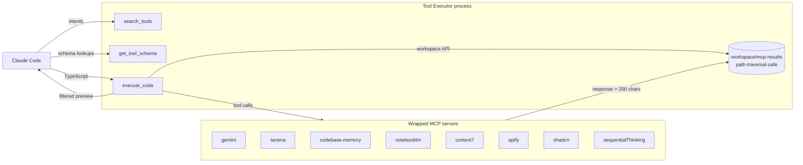

# Tool Executor

> **N tool calls, one round-trip.**
>
> `execute_code` lets you write a TypeScript block that calls 30 tools, aggregates their results, and returns a single payload to the model — bypassing the round-trip and the context-window costs that would otherwise make a workflow like that impossible.

A single MCP server exposes **3** tools to Claude Code and wraps **218** tools across **9** specialised servers behind them. Tool Executor is the control plane for Claude Code when you would otherwise wire up many MCP servers by hand.

| Tools exposed | Wrapped tools | Wrapped servers |
| ---: | ---: | ---: |
| **3** | **218** | **9** |

_Last generated: 2026-07-24. Run `pnpm run inventory` to refresh; see [Methodology](./docs/methodology.md)._

```text
search_tools("intent")  →  get_tool_schema("name")  →  execute_code(typescript)
```

## Why

### Round-trip cost

Without Tool Executor, Claude Code pauses after every MCP call. Five dependent calls mean five model round-trips, five prompt rebuilds, and five places to retry. Tool Executor collapses the dependency chain into a single `execute_code` block: the model writes one TypeScript program, the program walks the dependency graph, and the model sees one result. (`src/tools/execute.ts:16-35`, `src/sandbox/runtime.ts:275-327`.)

### Context-window bloat

Eight native MCP servers expose roughly 100–500 tokens per tool schema. Eight servers × 40 tools × 400 tokens ≈ 128k tokens before Claude reads a single file. Tool Executor ships three tool definitions of about 370 tokens each. Anything heavier is loaded on demand through `get_tool_schema`. (`src/index.ts:23-126`, `src/constants.ts:1-13`.)

### Registry sprawl and wrapper duplication

Tool Executor ships one registry schema, one schema-extraction script, and one layered config loader. Adding a new wrapped server takes one YAML file under `registry/<category>/<server>/<tool>.yaml` and one line in `tool-executor.config.json`. There is no second schema format to maintain. (`src/config.ts:13-67`, `scripts/extract-schemas.ts:147-199`.)

## Safety boundary

Read this before running `execute_code`. Tool Executor does not sandbox user code:

1. User TypeScript runs **in-process** via `AsyncFunction`. There is no VM isolation.
2. Tool calls inside the block share the **event loop with the MCP server itself**. A runaway call can wedge the server, not just waste tokens.
3. Today, the only protections are **workspace path-traversal checks** (`src/sandbox/workspace.ts:14-35`) and a **per-call timeout** of 30 seconds by default, capped at 10 minutes (`src/constants.ts:64-73`).

Treat submitted code and configured servers as trusted. Use `tool-executor.config.json` with `"trusted": true` only for servers you would otherwise run yourself. See [SAFETY.md](./docs/SAFETY.md) for the full boundary spec.

## Architecture



A short response returns inline. A response over 200 serialized characters is auto-saved to `workspace/mcp-results/` and replaced with `{ _savedTo, _preview, _size }` so the model's context stays flat. The executor does not stream; one call, one return. (`src/sandbox/runtime.ts:77-103`, `src/sandbox/runtime.ts:287-327`.)

## The three tools

### `search_tools` — find by intent

Slim discovery over every wrapped tool. Returns names, servers, and one-line descriptions; **never** the full schema. Backed by Serena semantic search, with BM25 and term matching as fallbacks. (`src/tools/search.ts:46-110`, `src/search.ts:444-488`.)

```json
{ "query": "generate images", "limit": 5 }
```

### `get_tool_schema` — load on demand

Fetch the JSON Schema and a generated example for a specific tool. Pay the schema token cost only for tools you actually call. (`src/tools/schema.ts:11-34`.)

```json
{ "name": "gemini-generate-image" }
```

### `execute_code` — one call, many tools

A sandboxed TypeScript runtime with pre-connected MCP client proxies. Call any wrapped tool, branch on results, loop, and aggregate before returning. Default timeout: 30 seconds. (`src/tools/execute.ts:16-35`, `src/sandbox/runtime.ts:275-327`.)

```typescript
const research = await gemini["gemini-deep-research"]({
  query: "latest MCP server patterns",
});
if (research._savedTo) {
  await workspace.writeJSON("research-summary.json", await workspace.readJSON(research._savedTo));
}
const diagram = await gemini["gemini-generate-image"]({
  prompt: "MCP server architecture diagram, clean technical style",
  aspectRatio: "16:9",
});
console.log("Saved summary. Diagram URL:", diagram.url);
```

## Working example

The full example lives in [`docs/examples/pr-summary.ts`](./docs/examples/pr-summary.ts). First 10 lines:

```typescript
import { workspace } from "@claudikins/tool-executor/runtime";

// 1. Detect the changed files via Serena's git-aware symbol graph
const diff = await codebase_memory["detect_changes"]({
  project: "claudikins-tool-executor",
  base_branch: "main",
});

// 2. Pull the docstrings for each changed symbol from the graph
const touched = await Promise.all(
  diff.changed.map((sym) =>
    codebase_memory["get_code_snippet"]({ project: "claudikins-tool-executor", symbol: sym }),
  ),
);

// 3. Ask Gemini for a one-paragraph PR summary
const summary = await gemini["gemini-summarize"]({
  text: touched.map((s) => s.body).join("\n\n"),
  maxWords: 60,
});
```

One round-trip. Three wrapped tools. No serial hand-offs. See the [example directory](./docs/examples/) for the full workflow and run instructions.

## Wrapped servers

Inventory generated from `registry/<category>/<server>/*.yaml`. Counts reflect registry entries; runtime availability depends on `tool-executor.config.json`.

| Category | Server | Wrapped tools |
| --- | --- | ---: |
| `ai-models` | `gemini` | 37 |
| `code-nav` | `intellij` (registry only) | 82 |
| `code-nav` | `serena` | 49 |
| `graph-analysis` | `codebase-memory` | 14 |
| `knowledge` | `context7` | 2 |
| `knowledge` | `notebooklm` | 20 |
| `reasoning` | `sequentialThinking` | 1 |
| `ui` | `shadcn` | 4 |
| `web` | `apify` | 9 |
| **Total** | | **218** |

> **Note:** `intellij` is registered for search-time discovery but is not a default runtime client. The eight default runtime servers are `gemini`, `serena`, `codebase-memory`, `notebooklm`, `context7`, `apify`, `shadcn`, and `sequentialThinking`. (`src/sandbox/clients.ts:23-81`.)

## Install

```bash
/marketplace add elb-pr/claudikins-marketplace
/plugin install claudikins-tool-executor
```

Requires Node.js 18+ and the underlying servers configured under `tool-executor.config.json`. For a Python MCP server, also install `uvx`; for the bundled `codebase-memory-mcp`, follow that project's install instructions. Run `claudikins doctor` afterwards to verify the registry, config, and command availability. (`src/cli.ts:77-155`.)

## Configuration

Tool Executor merges user configuration with built-in defaults across five locations (lowest → highest precedence): plugin dir, cwd, `~/.claude/tool-executor/`, `$XDG_CONFIG_HOME/tool-executor/`, `$TOOL_EXECUTOR_CONFIG`. Later entries override earlier ones by `name`. (`src/config.ts:156-276`.)

```json
{
  "servers": [
    {
      "name": "myserver",
      "displayName": "My Server",
      "command": "npx",
      "args": ["-y", "my-mcp-package"],
      "env": { "API_KEY": "${MY_API_KEY}" }
    }
  ]
}
```

Set `"trusted": true` when the command is not one of `npx`, `uvx`, `node`, `python`, or `codebase-memory-mcp`. Set `"disabled": true` to remove a default server without deleting it from config. See [CONFIGURATION.md](./docs/configuration.md) for layering rules, `disabled` semantics, and provenance reporting.

After editing config, run `claudikins extract --all` to regenerate registry YAML for the new server.

## Add your own

1. Add the server to `tool-executor.config.json` (start with a minimal `name`, `command`, `args` entry).
2. Run `claudikins extract --all` to generate `registry/<category>/<server>/*.yaml`.
3. Reinstall the plugin; the new server is now searchable and executable.

PRs that ship a useful wrapped server are welcome.

## When NOT to use this

- You use one or two MCP servers — connect them directly. The aggregation overhead is not worth it.
- You need streamed intermediate output — `execute_code` batches and returns once.
- You are building a production application — use the Anthropic SDK directly.
- You need sub-100 ms latency — sandbox preparation adds startup cost.

## Development

oxlint + oxfmt with a strict rule set tuned for low required context (explicit return types, sorted imports with `.js` extensions, no magic numbers). Pinned versions in `package.json`; upgrades are deliberate work.

| Script | What it does |
| --- | --- |
| `yarn lint` | Type-aware lint (no fixes). |
| `yarn lint:fix` | Auto-fix what's safely fixable. |
| `yarn format` | Format in-scope files in place. |
| `yarn fix` | One-shot: `format` → `lint --fix` → `format`. |

The `.githooks/pre-commit` hook runs `oxfmt --check` and `oxlint --type-aware` on staged in-scope files. A failed hook prints a `yarn fix` hint and aborts the commit — re-stage the fixes, then re-commit. Out-of-scope files (`registry/`, `docs/`, `dist/`, `tests/integration/`) skip lint/format entirely.

## Part of Claudikins

Tool Executor is the execution layer of the Claudikins framework — a set of Claude Code plugins designed to work together.

| Plugin | Purpose |
| --- | --- |
| **Tool Executor** | Programmatic MCP execution — you are here |
| **Automatic Context Manager** | Seamless context handoff across sessions |
| **Klaus** | Rigorous debugging with Germanic precision |
| **GRFP** | README generation through dual-AI research |

```bash
/marketplace add elb-pr/claudikins-marketplace
```

## License

[MIT](LICENSE) · Built by [Ethan Lee](https://github.com/elb-pr)
